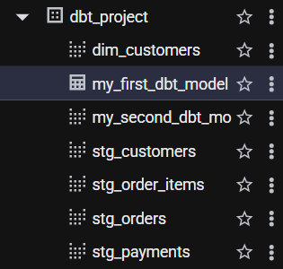
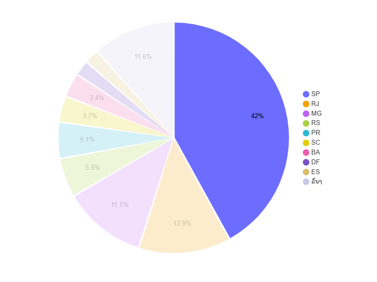

# 🛒 E-Commerce End-to-End Data Pipeline 
### *Modern Data Stack (ELT) on Google Cloud Platform*

---

## 📌 Project Overview
This project demonstrates a full-cycle **Modern Data Stack (MDS)** architecture. It automates the process of transforming raw, messy e-commerce data into structured, analytics-ready insights. The pipeline follows the **ELT (Extract, Load, Transform)** pattern, leveraging cloud-native tools to ensure scalability and reliability.

**Key Objectives:**
* Automate data ingestion from local/source to **Google BigQuery**.
* Implement data modeling using **dbt** (Data Build Tool) to create a Star Schema.
* Ensure data quality through automated testing.
* Visualize business KPIs such as Monthly Revenue, Customer Growth, and Top Product Categories.

---

## 🏗️ Architecture
The system architecture is designed with modularity in mind:

1.  **Extract & Load (EL):** Python script to ingest raw CSV data into **BigQuery (Raw Layer)**.
2.  **Transform (T):** Modular SQL modeling using **dbt** to create Staging, Intermediate, and Mart layers.
3.  **Orchestration:** **GitHub Actions** for scheduling and CI/CD.
4.  **Visualization:** **Looker Studio** for dynamic business dashboards.

---

## 🛠️ Tech Stack
| Category | Tool | Description |
| :--- | :--- | :--- |
| **Cloud Warehouse** | **Google BigQuery** | Primary data storage and compute engine. |
| **Data Transformation**| **dbt (Cloud/Core)** | For modular SQL modeling and documentation. |
| **Language** | **Python & SQL** | Core languages for ingestion and transformation. |
| **Orchestration** | **GitHub Actions** | Automating pipeline runs and testing. |
| **Visualization** | **Looker Studio** | BI tool for creating interactive dashboards. |
| **Infrastructure** | **Docker** | Ensuring a consistent environment for local development. |

---

## 🚀 Pipeline Details

### 1. Data Ingestion (Python)
The ingestion script (`scripts/upload_to_biguery.py`) handles:
* Connecting to Google Cloud using Service Account credentials.
* Schema auto-detection for raw CSV files.
* Loading data into a `raw_data` dataset in BigQuery.

### 2. Data Modeling (dbt)
The transformation logic is organized into three distinct layers:
* **Staging Layer:** Cleaning raw column names, casting data types, and handling duplicates.
* **Intermediate Layer:** Joining entities (e.g., combining `orders` with `payments`).
* **Mart Layer:** Final **Fact** and **Dimension** tables (e.g., `fct_orders`, `dim_customers`) optimized for BI tools.

### 3. Data Quality Assurance
* **Generic Tests:** Checking for `unique` keys and `not_null` values in critical columns.
* **Singular Tests:** Custom SQL tests to ensure business logic consistency (e.g., total_amount > 0).

---

## 📂 Project Structure
```bash
.
├── dbt_project/          # dbt models and configurations
│   ├── models/
│   │   ├── staging/      # Layer 1: Data cleaning & Type casting
│   │   ├── marts/        # Layer 2: Star Schema
│   │   └── sources.yml  
│   ├── tests/            # Custom data quality tests
│   └── dbt_project.yml
├── scripts/              # Python ingestion scripts
│   └── upload_to_bq.py
├── .github/workflows/    # CI/CD and Automation schedules
├── requirements.txt      # Project dependencies
└── README.md
```
---
## 🛠️ Installation & Setup
1. Clone the Repository:

```bash
git clone [https://github.com/your-username/ecommerce-data-pipeline.git](https://github.com/your-username/ecommerce-data-pipeline.git)
```

2. Download datatset by running loaddataset.py file
3. Run Ingestion:
```bash
python scripts/upload_to_bq.py
```
4. Execute dbt Models:
```bash
cd dbt_project
dbt build
```
---

# 🔄 Project Workflow & Data Pipeline Architecture

This document outlines the end-to-end data lifecycle of the E-commerce Data Platform, from raw data ingestion to final visualization.


---

## 🏗️ The 5-Step Workflow

### 1. Data Source & Preparation
* **Source:** Brazilian E-Commerce Public Dataset (Olist).
  link: https://www.kaggle.com/datasets/olistbr/brazilian-ecommerce
* **Format:** Static CSV files representing a relational database schema (Orders, Payments, Customers, etc.).
* **Simulation:** To simulate a real-world production environment, the pipeline is designed to process data in **Daily Incremental Batches** rather than a single bulk upload.

### 2. Automated Ingestion (Extract & Load)
This stage is triggered automatically by **GitHub Actions** (Scheduled Cron Job).
* **Trigger:** Every day at 00:00 UTC.
* **Process:** 1. The Python script (`upload_to_bq.py`) initializes.
    2. It identifies the "Watermark" (the latest date already present in BigQuery).
    3. It filters the source CSV for rows matching the "Current Date" (e.g., Today's orders).
    4. Data is appended to the **Raw Layer** in **Google BigQuery**.

### 3. Data Transformation (The dbt Cycle)
Once the raw data is landed, **dbt (Data Build Tool)** takes over to transform the "messy" data into a structured **Star Schema**.
* **Staging Layer:** Cleaning, renaming, and casting data types.
* **Intermediate Layer:** Joining tables (e.g., joining `orders` with `order_items` and `payments`).
* **Mart Layer:** Creating high-performance **Fact** and **Dimension** tables optimized for analytics.

### 4. Data Quality & Validation
Before the data reaches the dashboard, automated tests are executed:
* **Schema Tests:** Ensuring `order_id` is unique and `customer_id` is not null.
* **Business Logic Tests:** Verifying that `order_delivery_date` is not before `order_purchase_timestamp`.
* **Failure Alerting:** If a test fails, the workflow stops, and an alert is sent to prevent corrupted data from reaching the BI tool.

### 5. Visualization & Business Intelligence
* **Connection:** **Looker Studio** connects directly to the `marts` dataset in BigQuery.
* **Refresh:** The dashboard automatically reflects the new data appended by the daily pipeline.
* **KPIs:** Monitoring Revenue trends, Customer lifetime value (CLV), and Logistics performance.

### 6. Result

